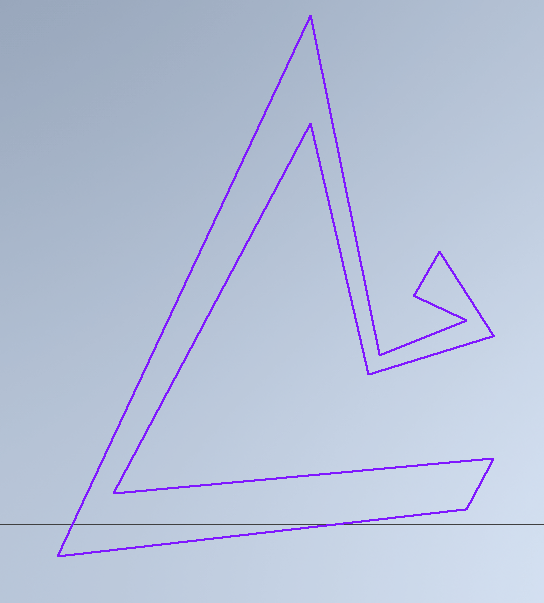
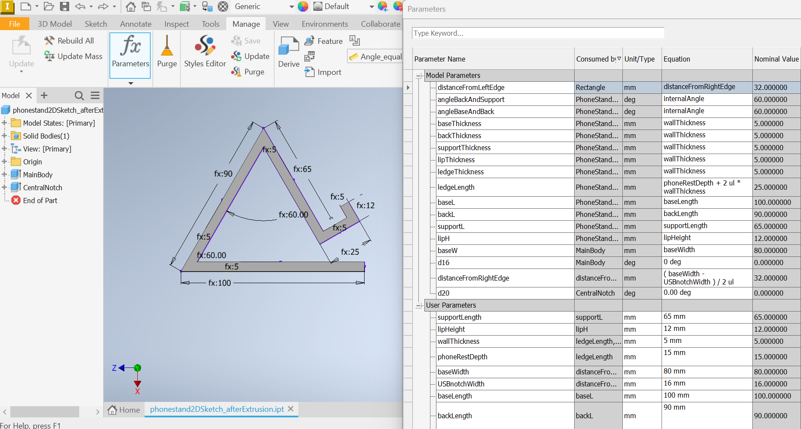
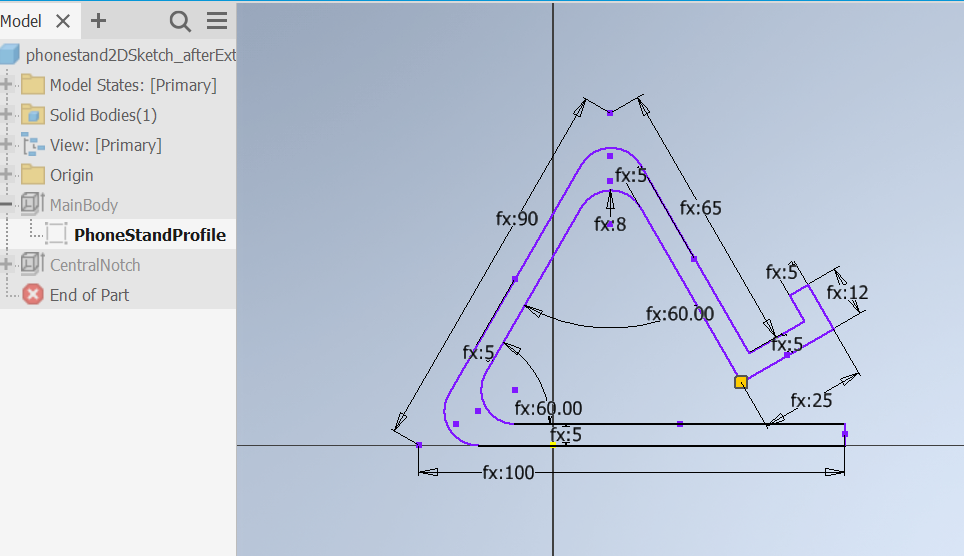
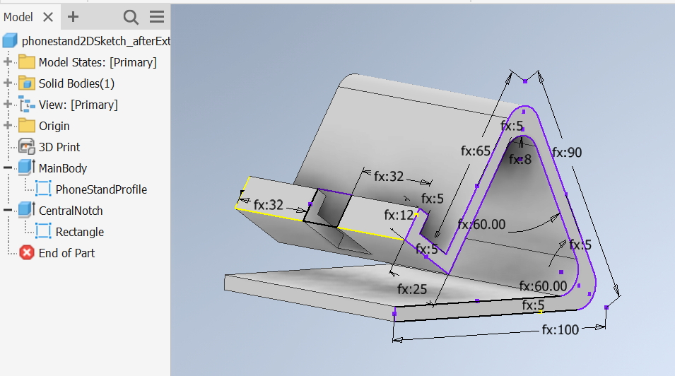

# Computer Aided Design

Computer-Aided Design (CAD) is software for creating precise digital designs. In engineering, it helps develop products by allowing testing and refinement before manufacturing. Architects use it to design buildings and generate construction documents. Manufacturers rely on CAD to create machine instructions and tooling designs. Industrial designers employ it for prototyping products and testing aesthetics.

CAD enables collaboration by letting teams share and modify designs digitally. It reduces errors through built-in validation and makes changes faster than paper drawings. The software can simulate real-world conditions, helping identify problems early. Different industries use specialized CAD programs tailored to their needs, from mechanical parts to building layouts.

Additionally, CAD connects directly to modern manufacturing methods like 3D printing and CNC machining. This seamless integration between design and production has revolutionized how things are made, allowing for more complex designs and faster development cycles.

Today we'll learn to design a Phone Case Stand in Autodesk Inventor. Next week, we'll transform your digital designs into physical objects using our 3D printer, bringing your creations to life.

# Phone Case Stand Design Instructions
## Autodesk Inventor Tutorial

### Getting Started
Launch Autodesk Inventor. When the welcome screen appears, click "New" and select "Standard.ipt" under the "Part" tab. This creates a new part file where we'll design our phone case stand.

### Setting Up Your Workspace
First, we'll set up the workspace and units:
Navigate to Tools > Document Settings > Units. Set the unit type to millimeters. Click "Apply" and "OK."

### Creating the Profile
1. Start in the "Sketch" environment by selecting "Create 2D Sketch" and choosing the XY plane.
2. Use the "Line" tool to draw a the profile of the phone stand as directed.
   I personally think that it is better to "sketch" in a purpusefully inacurate way, (but with the right topology)

   
    
4. Click the "Dimension" tools and add the constraints as directed.
   It helps so start with parallel line constraints, and then you can move on to perpendicular constraints.  
6. Click the "Dimension" tool and add precise measurements by clicking on each line and typing the exact dimensions.
   At this point your diagram should like like the following:

   
   
   
8. Add the fillet to the internal and external outlines for the back and the top of the phone case. (Suggested 8 mm)

      
   
### Extruding Main Body
1. Find the "Extrude" command in the "3D Model" tab.
2. Click on your phone stand profile and set the extrusion height to 80 mm.
3. Click the green checkmark to confirm.

### Adding the Charging Cable Phone Slot
1. On the top surface of your support, create another sketch.
2. Draw a rectangle 18mm wide and 12 mm high for the phone slot.
3. Center the rectangle onto the 
4. Exit the sketch and use "Extrude" to create a deep slot that goe to the next surface.

Your work should look similar to
      

### Optional: Creating Fillets (Rounded Edges)
1. Select the "Fillet" tool from the "3D Model" tab.
2. Click all sharp external edges.
3. Set the radius to 2mm.
4. Click the green checkmark to apply.

### Optional : Adding Features
To prevent your phone from sliding, you can add some friction features. Create a new sketch on the top surface of the base and draw small rectangular patterns. These can be extruded slightly (about 0.05 inches) to create grip textur

### Saving Your Work
1. Click File > Save As
2. Choose a location on your computer
3. Name your file "PhoneCaseStand"
4. Click Save

### Testing Your Design
Review your model by:
1. Using the orbit tool (middle mouse button) to rotate around your design
2. Checking that all dimensions are correct
3. Ensuring the phone slot is deep enough
4. Verifying that all edges are properly filleted

### Generating STL File for 3D Printing
The STL file format is the standard file type used for 3D printing. To create an STL file:

1. Click File > Save As
2. In the "Save As" dialog, click the "Save as type" dropdown
3. Select "STL Files (*.stl)"
4. Choose your save location
5. Before clicking Save, click "Options"
6. In the STL Options dialog:
   - Set units to millimeters
   - Resolution: High
   - Surface deviation: 0.012 mm
   - Normal deviation: 10 degrees
7. Click OK
8. Click Save

The resulting STL file can now be used with any 3D printing software (slicer) to create the physical model. The high resolution settings ensure smooth curves and accurate dimensions in your printed model.

### Common Issues and Solutions
If you can't select a face: Make sure you're in the correct environment (sketch vs. 3D model)
If dimensions aren't updating: Check that you're not in a sketch mode
If extrusions fail: Verify that your sketch is fully constrained (all lines should be black, not blue)

### Tips for Success
Make all sketches fully constrained before extruding
Use the middle mouse button to orbit around your model frequently
Save your work regularly
If you make a mistake, use the Undo command (Ctrl+Z)

For additional help, use Inventor's built-in help system by pressing F1, or ask your instructor for guidance.
