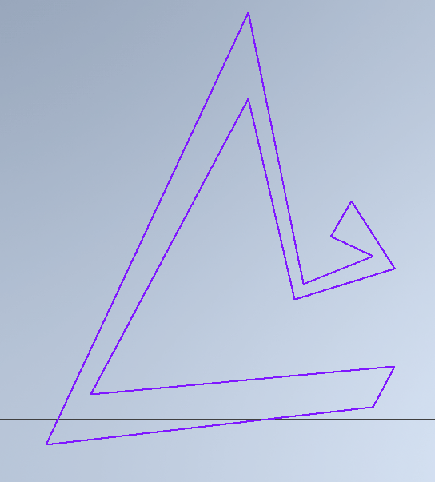
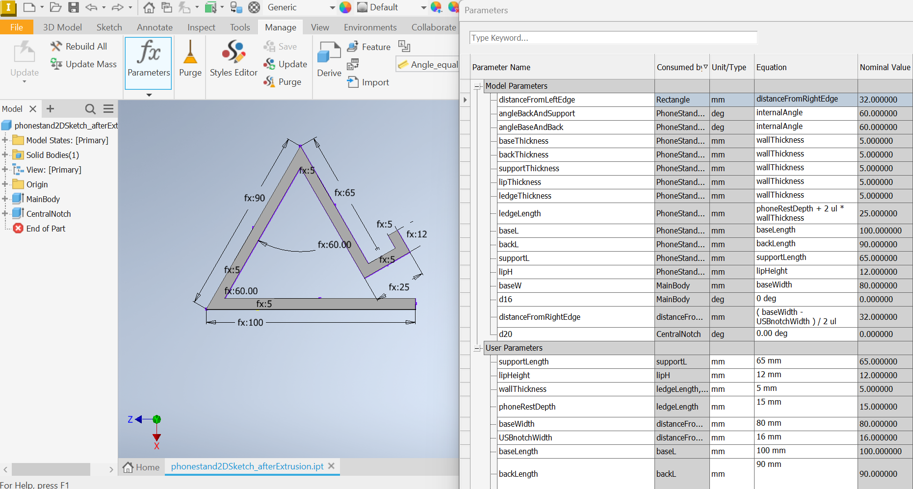
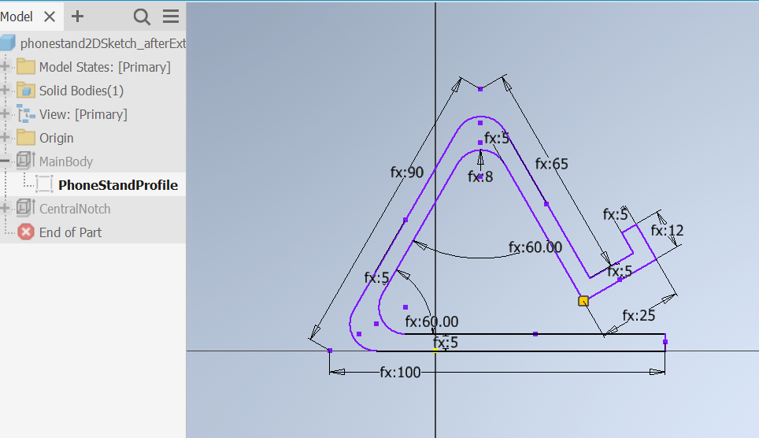
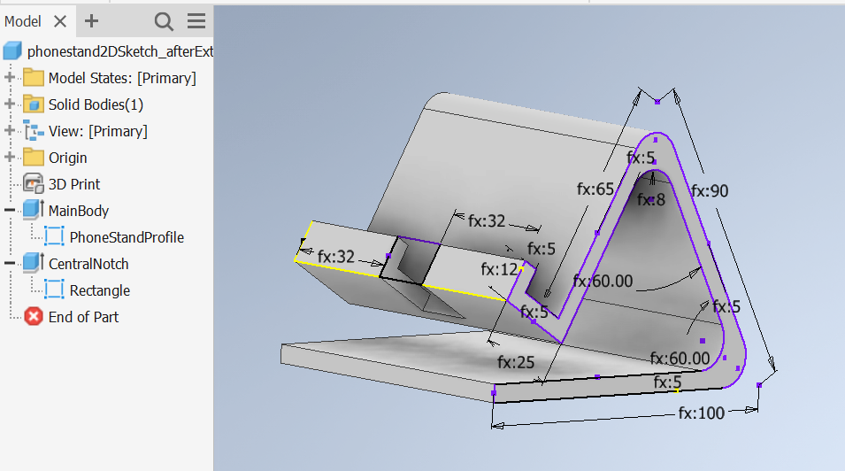

# Computer-Aided Design

Computer-Aided Design (CAD) is software for creating precise digital designs. In engineering, it helps develop products by allowing testing and refinement before manufacturing. Architects use it to design buildings and generate construction documents. Manufacturers rely on CAD to create machine instructions and tooling designs. Industrial designers employ it for prototyping products and testing aesthetics.

CAD enables collaboration by letting teams share and modify designs digitally. It reduces errors through built-in validation and makes changes faster than paper drawings. The software can simulate real-world conditions, helping identify problems early. Different industries use specialized CAD programs tailored to their needs, from mechanical parts to building layouts.

Additionally, CAD connects directly to modern manufacturing methods like 3D printing and CNC machining. This seamless integration between design and production has revolutionized how things are made, allowing for more complex designs and faster development cycles.

Today we'll learn to design a phone case stand in Autodesk Inventor. Next week, we'll transform your digital designs into physical objects using our 3D printer, bringing your creations to life.

# Phone Case Stand Design Instructions
## Autodesk Inventor Tutorial

### Getting Started
Launch Autodesk Inventor. On the Home screen, click "New," open the "Metric" templates, and select "Standard (mm).ipt" under "Part." This creates a new part file, measured in millimeters, where we'll design our phone case stand.

### Setting Up Your Workspace
If you started from a different template, check the units:
On the "Tools" tab, click "Document Settings," then open the "Units" tab. Set the length unit to millimeter. Click "Apply" and then "Close."

### Creating the Profile
1. Start in the "Sketch" environment by selecting "Start 2D Sketch" and choosing the XY plane.
2. Use the "Line" tool to draw the profile of the phone stand as directed.
   I personally think that it is better to sketch in a purposefully inaccurate way (but with the right topology).

   

3. Use the tools in the "Constrain" panel to add the geometric constraints as directed.
   It helps to start with parallel constraints, and then you can move on to perpendicular constraints.
4. Click the "Dimension" tool and add precise measurements by clicking on each line and typing the exact dimensions.
   At this point, your diagram should look like the following:

   

5. Add fillets to the internal and external outlines at the back and the top of the phone case (suggested radius: 8 mm).

   

6. Click "Finish Sketch."

### Extruding the Main Body
1. Find the "Extrude" command on the "3D Model" tab.
2. Click on your phone stand profile and set the extrusion distance to 80 mm.
3. Click "OK" (or the green checkmark) to confirm.

### Adding the Charging Cable Slot
1. On the top surface of your support, start a new 2D sketch.
2. Draw a rectangle 18 mm wide and 12 mm high for the slot.
3. Center the rectangle on the face (for example, by constraining the midpoint of one of its sides to the midpoint of the face's edge).
4. Finish the sketch and use "Extrude" with the "Cut" option and the "To Next" extent to create a slot that goes through to the next surface.

Your work should look similar to this:

### Optional: Creating Fillets (Rounded Edges)
1. Select the "Fillet" tool from the "3D Model" tab.
2. Click all sharp external edges.
3. Set the radius to 2 mm.
4. Click "OK" to apply.

### Optional: Adding Features
To prevent your phone from sliding, you can add some friction features. Create a new sketch on the top surface of the base and draw small rectangular patterns. These can be extruded slightly (about 1 mm) to create a grip texture.

### Saving Your Work
1. Click File > Save As.
2. Choose a location on your computer.
3. Name your file "PhoneCaseStand."
4. Click Save.

### Testing Your Design
Review your model by:
1. Rotating around your design with the Orbit tool (press F4 or hold Shift and drag with the middle mouse button)
2. Checking that all dimensions are correct
3. Ensuring the phone slot is deep enough
4. Verifying that all edges are properly filleted

### Generating an STL File for 3D Printing
The STL file format is the standard file type used for 3D printing. To create an STL file:

1. Click File > Export > CAD Format (or File > Save As > Save Copy As).
2. In the "Save as type" dropdown, select "STL Files (*.stl)."
3. Choose your save location.
4. Before clicking Save, click "Options."
5. In the STL options dialog:
   - Format: Binary
   - Units: Millimeter
   - Resolution: High
6. Click OK.
7. Click Save.

The resulting STL file can now be used with 3D printing software (such as PreForm for our Form 2 printer) to create the physical model. The high-resolution setting ensures smooth curves and accurate dimensions in your printed model.

### Common Issues and Solutions
- **You can't select a face:** Make sure you're in the correct environment (sketch vs. 3D model).
- **Dimension changes don't appear on the 3D model:** Finish the sketch, or click "Update" on the Quick Access Toolbar, so the model rebuilds.
- **Extrusions fail or the profile can't be selected:** Check that your profile is closed, with no gaps or overlapping lines at the corners.

### Tips for Success
- Fully constrain your sketches before extruding; the status bar will read "Fully Constrained."
- Orbit around your model frequently to check it from every side.
- Save your work regularly.
- If you make a mistake, use the Undo command (Ctrl+Z).

For additional help, use Inventor's built-in help system by pressing F1, or ask your instructor for guidance.
