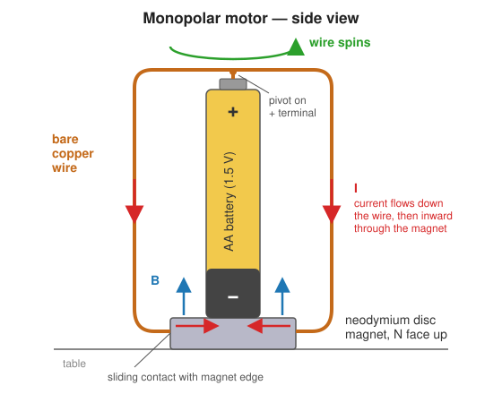
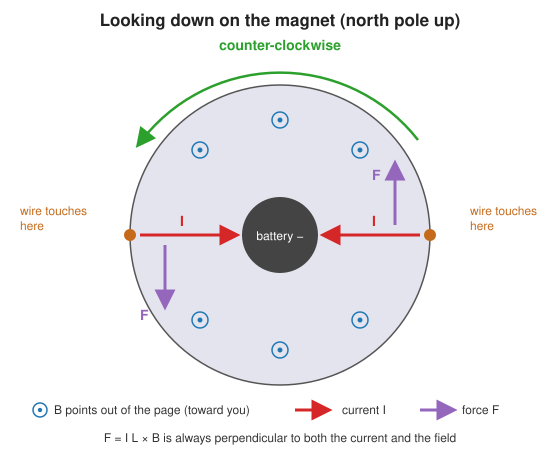
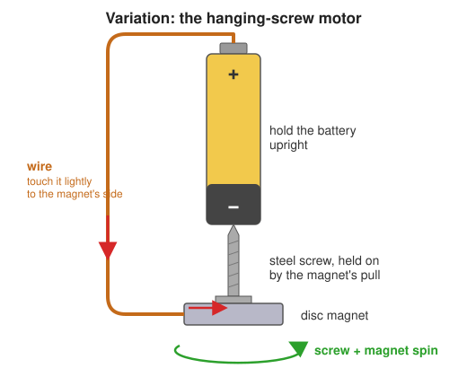

# The Monopolar Motor

The monopolar motor (also called a _homopolar_ or _unipolar_ motor) is the simplest electric motor you can build. It needs only three parts: a battery, a magnet, and a piece of copper wire. Michael Faraday demonstrated the first motor of this kind in 1821, and it was the first device ever to turn electricity into continuous motion.

It is called _monopolar_ because the current always flows in the same direction through the same magnetic field. A conventional motor, like the coil motor you build in this session, has to flip its current every half turn with a commutator. The monopolar motor never needs to do that, so it has no brushes, no commutator and no coil.

## What You Need

| Item | Notes |
|---|---|
| AA battery (1.5 V) | A fresh alkaline cell works best. Do not use rechargeable cells (see [Safety](#safety)). |
| Neodymium disc magnet | Slightly wider than the battery, for example 12–19 mm across. Must be electrically conductive (nickel-plated neodymium is). |
| Bare copper wire | About 25–30 cm of 14–18 gauge (1–1.6 mm) wire with no enamel or plastic coating. |
| Needle-nose pliers | For bending the wire. |
| Wire cutters | |

## Building the Motor

1. **Make the base.** Stand the magnet flat on the table and place the battery on top of it, negative (−) terminal down. The magnet sticks to the steel case of the battery and makes electrical contact with the negative terminal.
2. **Find the middle of the wire.** Bend a small dimple or point at the centre of the wire. This is the pivot that will rest on the positive (+) terminal.
3. **Shape the wire.** Bend the two halves down so they hang on either side of the battery. At the bottom, curve the ends inward so they lightly touch the sides of the magnet. Popular shapes include a rectangle, a heart and a spiral; anything works as long as the wire is balanced.
4. **Balance it.** Rest the pivot on the + terminal. The wire should sit level and the ends should brush the magnet without squeezing it. Adjust until it does.
5. **Let go.** The wire should start spinning on its own. If it doesn't, see [Troubleshooting](#troubleshooting).

The ends of the wire act as _sliding contacts_: they keep touching the magnet while they spin around it, so the circuit stays closed the whole time.

## How It Works

### The circuit

Conventional current leaves the + terminal at the top of the battery, runs down both sides of the copper wire, enters the magnet at its edge, flows inward through the magnet to its centre, and returns to the battery through the − terminal. The magnet is doing two jobs at once: it supplies the magnetic field and it is part of the wire.

### The force

A wire carrying current _I_ through a magnetic field **B** feels a force

$$\vec{F} = I\,\vec{L} \times \vec{B}$$

where $\vec{L}$ points along the wire in the direction of the current. Because of the cross product, the force is perpendicular to both the current and the field.

Near the bottom of the motor, the field of the magnet points mostly straight up (if the north face is up) and the current flows horizontally toward the axis. Inward × up gives a force that is _sideways_, tangent to a circle around the battery:

On the left side the force points one way, on the right side it points the opposite way, and together they make a torque that turns the wire around the battery. Since the current and field never change direction relative to the wire, the torque never reverses and the wire keeps spinning.

### Right-hand rule

To check the direction yourself: point the fingers of your right hand along the current, curl them toward the magnetic field, and your thumb points along the force. In the diagram above, with the north face up, the wire turns **counter-clockwise** seen from above.

Try it: flip the magnet over (south face up) or turn the battery upside down. Either change reverses one of the vectors, so the motor spins the other way. Flipping _both_ leaves the direction unchanged.

### How big is the force?

A rough estimate with typical values:

| Quantity | Typical value |
|---|---|
| Current _I_ | 1–3 A (the circuit is almost a short circuit) |
| Field _B_ near the magnet's edge | 0.1–0.3 T |
| Length _L_ of wire in the strong field | about 1 cm = 0.01 m |

$$F = ILB \approx (2\ \text{A})(0.2\ \text{T})(0.01\ \text{m}) = 0.004\ \text{N}$$

That is about the weight of a 0.4 g object, which is tiny, but the copper wire is light and the pivot has very little friction, so it is enough to make it spin quickly.

### Why doesn't it speed up forever?

As the wire moves through the magnetic field, it generates a voltage of its own (Faraday's law of induction) that opposes the battery. This _back-EMF_ grows with speed. For a conductor sweeping out a disc of radius _R_ at angular speed _ω_,

$$\mathcal{E}_\text{back} = \tfrac{1}{2} B \omega R^2$$

The motor speeds up until the back-EMF plus friction and air drag balance what the battery can supply. This is the same principle that limits the top speed of every electric motor. Run backwards, the device is a _homopolar generator_ (Faraday's disc): spin a conducting disc in a magnetic field and a steady DC voltage appears between its centre and its rim.

## Variation: The Hanging-Screw Motor

This version takes about 30 seconds to build and spins much faster.

1. Stick the magnet to the head of a steel screw (a drywall screw works well).
2. Touch the tip of the screw to the − terminal of the battery. The magnet magnetizes the screw, so the screw hangs from the battery on its own.
3. Hold one end of a wire on the + terminal and _lightly_ touch the other end to the side of the magnet.

The screw and magnet spin together. The physics is identical: current flows radially through the magnet inside an axial magnetic field. Here the magnet turns instead of the wire, and the sharp screw tip makes an almost frictionless bearing.

## Troubleshooting

| Problem | Likely cause and fix |
|---|---|
| Nothing happens | The wire is coated. Sand the ends and the pivot point, or use bare wire. |
| Nothing happens | The battery is dead. Try a fresh one. |
| The wire twitches but doesn't spin | Poor contact at the bottom. Bend the ends so they touch the magnet more consistently. |
| The wire falls off | It's unbalanced. Make both halves the same shape and weight, and deepen the pivot dimple. |
| The wire jams against the magnet | The ends press too hard. Open the curve slightly so they just brush the magnet. |
| It spins slowly | Too much friction at the pivot or bottom contacts. Lighten the contact pressure. |

## Safety

- **The battery heats up.** The motor is essentially a short circuit and draws several amperes. Run it for short bursts only, and don't hold the battery for long. A battery that gets hot should be set aside to cool.
- **Use alkaline cells only.** Rechargeable cells (NiMH, lithium) can deliver much larger currents and get dangerously hot when shorted.
- **Neodymium magnets are strong.** They can pinch skin when they snap together and can shatter if they collide. Keep them away from phones, credit cards, and pacemakers.
- **Wire ends are sharp.** Handle cut wire carefully and keep it away from your eyes.

## Questions to Think About

1. Use the right-hand rule to predict which way your motor spins before you let go. Were you right?
2. Why must the magnet be electrically conductive? What would happen with a ceramic (ferrite) magnet?
3. If you stack a second magnet under the first, does the motor spin faster? Why or why not?
4. Where along the wire is the force largest? Where is it close to zero? (Hint: think about the angle between the wire and the field.)
5. Your coil motor needs a commutator but this one doesn't. Explain why in terms of the direction of the current relative to the field.
6. The motor draws about 2 A from a 1.5 V battery. What power does it use? Where does most of that energy end up?

## Further Reading

- Michael Faraday, "On some new Electro-Magnetical Motions, and on the Theory of Magnetism," _Quarterly Journal of Science_ 12 (1821), the original description of the first electric motor.
- [Homopolar motor](https://en.wikipedia.org/wiki/Homopolar_motor) on Wikipedia.
