Today, we will be learning about how we can gather data in a systematic fashion. In addition, we will see that we can also control the external world programmatically. These two insights are useful for engineers to control devices, or for scientists that need to design scientific instrumentation.

We will be using a microcontrollers (MCU) to achieve our purposes. Unlike desktops or smartphones which distribute functions over several chips, microcontrollers typically are self-contained, meaning that the computing engine, memory, and interfaces reside on a single chip. They include a flexible interface to attach a wide variety of peripherals such sensors, LEDs, motor controllers etc. The microcontroller we will be using is the Feather M4 clocking at 120 Mhz. It is thirty times as fast as the first desktop computer I owned. The M4 is mounted onto a board that exposes the pins and contains additional circuitry that allows connection of the M4 to a computer via USB interface. This enables programming and exchange of data of the MCU with a computer.

The M4 has four indicator LEDs, on the top of the PCB, for easy debugging. One green power LED, two RX/TX LEDs for the UART, and a red LED connected to pin \#13. The M4 Express has built in USB-to-Serial converter, automatic bootloader reset, Lithium Ion/Polymer charger, and multiples GPIO. That module nestled under the black cover is a 120MHz Cortex M4 with floating point support and 512KB Flash and 192KB RAM. There's a hardware SPI port, hardware I2C port and hardware UART to USB. This doesn’t speak to you right now, but that simply means it has many standard protocols of communication.

The M4 Feather comes as a fully assembled and tested board. We have soldered headers in for you.

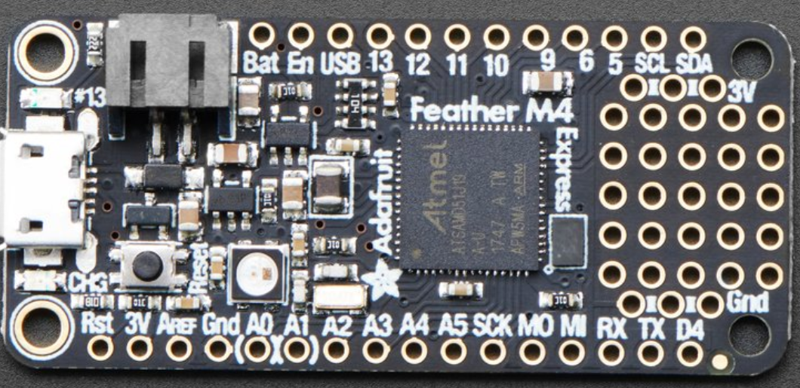

**Figure 1:** The M4 chip contains the processor and flash memory for storing program code and data. The smaller SIL chip handles the connection to the host computer via USB. The pins for the analog and digital I/O lines are spaced such that the PCB can be plugged into a solderless breadboard.

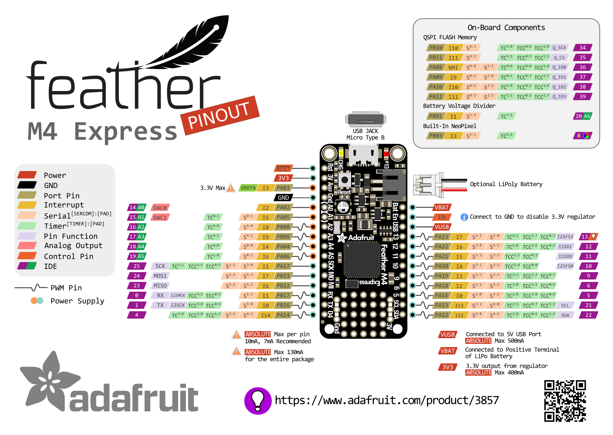The figure below shows the connection diagram of the [M4 Express microcontroller board](https://www.adafruit.com/product/3405), an [M4 microcontroller](https://en.wikipedia.org/wiki/ESP32) mounted on a printed circuit board (PCB) with some additional components to support rapid prototyping.

*Figure 2. M4 express microcontroller pin connection diagram*

# The Solderless Breadboard

The M4 is a powerful little micro-controller. However, you will need to build external circuits to interface to the board. Engineers, hobbyists, and makers often utilize a solderless breadboard to quickly build circuits and proto-type ideas.

Looking at a breadboard, you will see many, many little holes where you can stick wires and various components. Each row of 5 “holes” are connected internally by a metal clip.

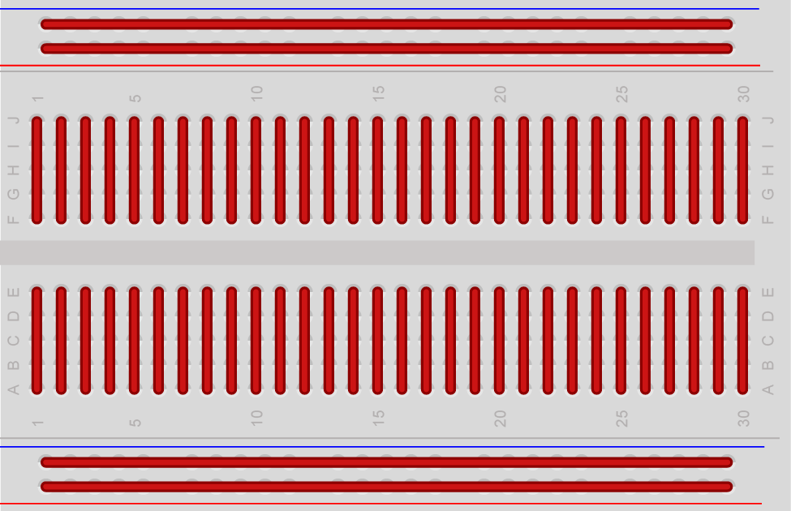

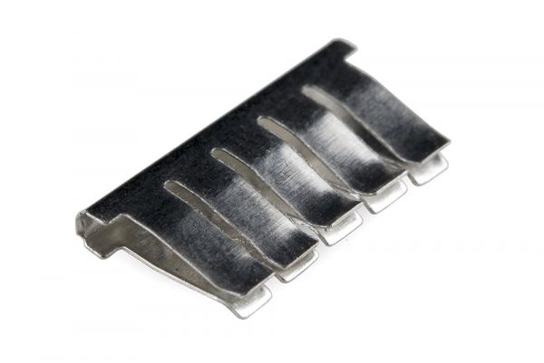

Here is one of the clips removed from the back of a breadboard.

Any wires or metal leads that are inserted into the holes will be electrically connected to anything else placed in that row. This is because the metal rows are conductive and allow current to flow from any point in that strip.

Notice that there are only five clips along this strip. This is typical on almost all breadboards. The row has ten holes separated by a ravine or crevasse, in the middle of the breadboard. This ravine isolates both sides of a given row from one another, and they are not electrically connected.

In addition to the rows, there are two columns on either side of the board. These are called the **Power Bus**. The column is connected by one continuous rail of metal clips. Engineers generally run 3V to the (+) side column and GND to the (-) side column.

**Exercise 1.**

The word “circuit” has the same root as the word circle. A circuit must have a complete loop that includes a power source. 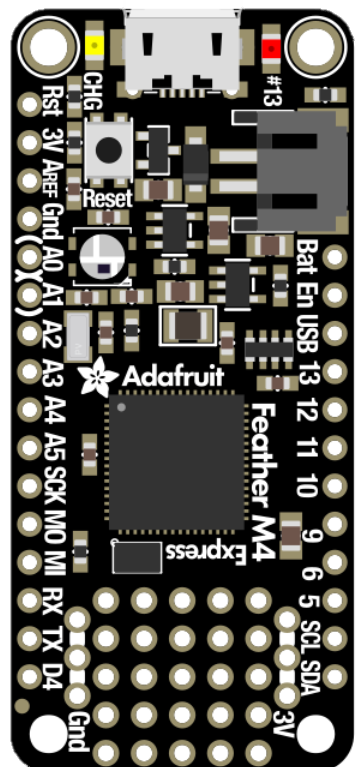

Larger circuits can often become quite complex. In practice, engineers often simplify their drawings of the “circuit” by using (+V) to designate the positive side of the power and (GND) or ground to designate the negative. Do you see the similarity between the two circuits diagrams?

1.  Build up the circuit as shown above. Connect the M4 Express with the micro USB to power it. If you’ve done it correctly, the LED should light up! If it doesn’t try and figure out why. (Hint: Take a look at your LED, the longer leg is the positive end)

***

**Exercise 2.**

For this exercise you will learn how to control the status of the LED

The first thing you'll want to do is download the most recent version of CircuitPython. This is a bit of a tedious process. Fortunately, we only need to do it once.

Download the latest software for your board by clicking the green button below to go to [CircuitPython](https://circuitpython.org/downloads).org.

Our board is a Feather M4 Express, so you should download the latest **stable** release that will work with the Feather M4 express (<https://circuitpython.org/board/feather_m4_express/>) The file format is UF2 (which stands for USB Flasher Version 2). Save the file onto your laptop.

Start the UF2 Bootloader

***

Nearly all CircuitPython boards ship with a bootloader called UF2 (**U**SB **F**lasher version **2**) that makes installing and updating CircuitPython a quick and easy process. The bootloader is the mode your board needs to be in for the CircuitPython **.uf2** file you downloaded to work.

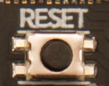

Find the reset button on your board. It's a small, black button, and the only button available.

Tap this button twice to enter the bootloader. If it doesn't work on the first try, don't be discouraged. The rhythm of the taps needs to be correct and sometimes it takes a few tries. Once successful, the RGB LED on the board will flash red and then stay green. A new drive will show up on your computer. The drive will be called FEATHERBOOT. 

The board is now in bootloader mode! This is what we need to install or update CircuitPython.

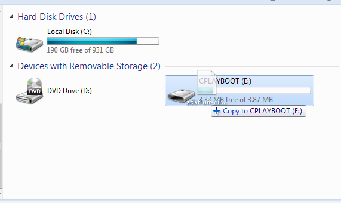Now find the file you downloaded. Drag that file to the FEATHERBOOT drive on your computer.

The lights should flash again, FEATHERBOOT will disappear and a new drive will show up on your computer called CIRCUITPY.

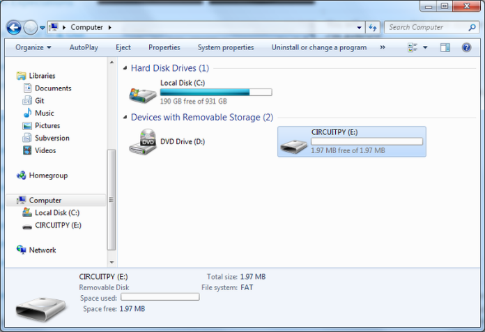

Congratulations! You've successfully installed or updated CircuitPython!

**What's the difference between CIRCUITPY and FEATHERBOOT?**

When you plug a CircuitPython board into your computer, your computer will see the board's flash memory as a USB flash drive where files can be stored. When you have successfully installed CircuitPython, you'll see the CIRCUITPY drive. When you double-tap the reset button, you'll see the FEATHERBOOT drive. You can drag files to both, but only CIRCUITPY will run your CircuitPython code.

Normally, when you drag a file to a mounted USB drive, the file copies to the drive and then is able to be seen in your file explorer. However, when you drag the CircuitPython UF2 file to the FEATHERBOOT drive, it seems to disappear, and the drive disconnects. This is normal! The UF2 is essentially an installer file, and does not simply sit on the drive, but installs CircuitPython if the board is in bootloader mode (i.e. FEATHERBOOT).

You will be able to copy other files to the bootloader drive (FEATHERBOOT) but they will not run or be accessible to CircuitPython. So make sure that once you're done installing CircuitPython, that you're dragging to and editing files on the CIRCUITPY drive!

**The CIRCUITPY Drive**

When CircuitPython finishes installing, or you plug a CircuitPython board into your computer with CircuitPython already installed, the board shows up on your computer as a USB drive called **CIRCUITPY**.

The **CIRCUITPY** drive is where your code and the necessary libraries and files will live. You can edit your code directly on this drive and when you save, it will run automatically. When you create and edit code, you'll save your code in a code.py file located on the **CIRCUITPY** drive. If you're following along with a Learn guide on adafruit, you can paste the contents of the tutorial example into code.py on the **CIRCUITPY** drive and save it to run the example.

CircuitPython looks for code.py and runs the contents of the file automatically when the board starts up, reloads, or when you save changes to the file. This is what makes it so easy to get started with your project and update your code!

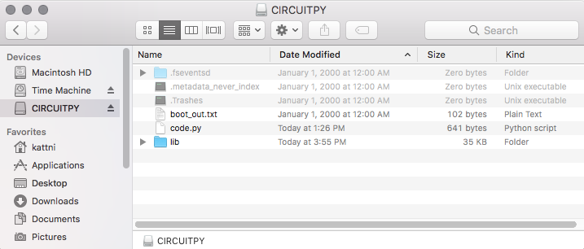

**Creating and Editing Code**

One of the best things about CircuitPython is how simple it is to get code up and running. In this section, we're going to cover how to create and edit your first CircuitPython program.

To create and edit code, all you'll need is an editor. There are many options. **We will be using Mu! It's designed for CircuitPython, and it's really simple and easy to use, with a built in serial console!**

(https://codewith.mu/en/download)

Creating Code

| 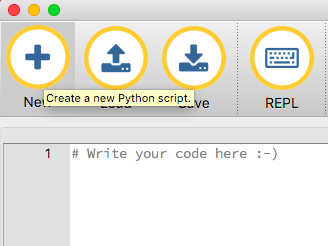 | Open your editor, and create a new file. If you are using Mu, click the **New** button in the top left |
|-------------------------------------------------------------------------------------------------------|--------------------------------------------------------------------------------------------------------|

Write the following code into your editor:

````python
1.  import board
2.  import digitalio
3.  import time
4.  
5.  led = digitalio.DigitalInOut(board.D13)
6.  led.direction = digitalio.Direction.OUTPUT
7.  
8.  while True:
9.    led.value = True
10.   time.sleep(0.5)
11.   led.value = False
12.   time.sleep(0.5)
````


| 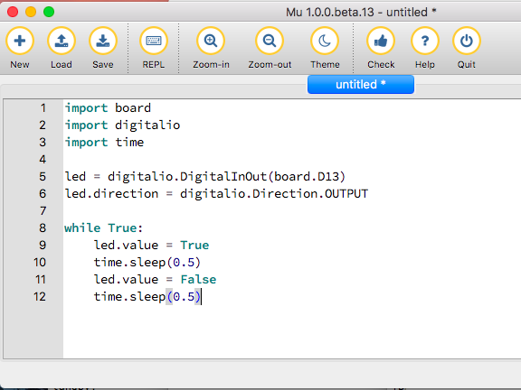   | It will look like this - note that under the while True: line, the next four lines have spaces to indent them, but they're indented exactly the same amount. All other lines have no spaces before the text. |
|---------------------------------------------------------------------------------------------------------|--------------------------------------------------------------------------------------------------------------------------------------------------------------------------------------------------------------|
| 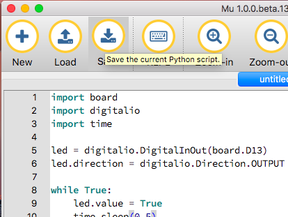   | Save this file as **code.py** on your CIRCUITPY drive.       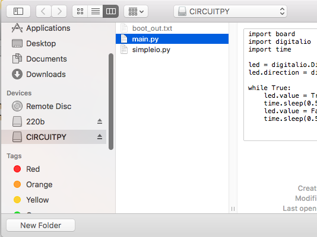                                           |

**Editing Code**

| 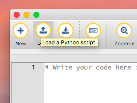 | To edit code, open the **code.py** file on your CIRCUITPY drive into your editor.   Make the desired changes to your code. Save the file. That's it! |
|-------------------------------------------------------------------------------------------------------|------------------------------------------------------------------------------------------------------------------------------------------------------|

Your code changes are run as soon as the file is done saving.

There's just one warning we have to give you before we continue...

The CircuitPython code on your board detects when the files are changed or written and will automatically re-start your code. This makes coding very fast because you save, and it re-runs.

Back to Editing Code...


Now! Let's try editing the program you added to your board. Open your **code.py** file into your editor. We'll make a simple change. Change the first 0.5 to 0.1. The code should look like this:

````python
1.  import board
2.  import digitalio
3.  import time
4.  
5.  led = digitalio.DigitalInOut(board.D13)
6.  led.direction = digitalio.Direction.OUTPUT
7.  
8.  while True:
9.    led.value = True
10.   time.sleep(0.1)
11.   led.value = False
12.   time.sleep(0.5)
````

Leave the rest of the code as-is. Save your file. See what happens to the LED on your board? Something changed! Do you know why? Let's find out!

Exploring Your First CircuitPython Program

***

First, we'll take a look at the code we're editing.

Here is the original code again:

````python
1.  import board
2.  import digitalio
3.  import time
4.  
5.  led = digitalio.DigitalInOut(board.D13)
6.  led.direction = digitalio.Direction.OUTPUT
7.  
8.  while True:
9.    led.value = True
10.   time.sleep(0.5)
11.   led.value = False
12.   time.sleep(0.5)
````

Exercise 3

For this exercise you will learn how to control the status of am external LED

1.  Now, take out the wire that you used to connect the LED to the power bus from the previous circuit. Move this wire over to Digital I/O Pin 12. Pin 12 behaves like a switched power source that the M4 Express can control! It gives 3v or 0v depending on your program. You can vary it at will.

***


2.  Start the MU program and write the code.

***

3.  Save it as **code.py**, your code show run and the light should blink.

***
