Today, we will be learning how to gather data in a systematic fashion. In addition, we will see that we can also control the external world programmatically. These two insights are useful for engineers who control devices and for scientists who need to design scientific instrumentation.

We will be using a microcontroller (MCU) to achieve our purposes. Unlike desktops or smartphones, which distribute functions over several chips, microcontrollers are typically self-contained, meaning that the computing engine, memory, and interfaces reside on a single chip. They include a flexible interface to attach a wide variety of peripherals, such as sensors, LEDs, and motor controllers. The microcontroller board we will be using is the Feather M4 Express, which runs at 120 MHz. It is thirty times as fast as the first desktop computer I owned. The M4 chip is mounted on a board that exposes the pins and contains additional circuitry that allows the M4 to connect to a computer through a USB interface. This enables programming the MCU and exchanging data between the MCU and a computer.

The Feather M4 Express has three indicator LEDs on the top of the PCB for easy debugging: a red LED connected to pin \#13, an RGB NeoPixel status LED, and a charging LED for the battery. The board has native USB support, an automatic bootloader reset, a lithium-ion/polymer battery charger, and many GPIO (general-purpose input/output) pins. The chip in the middle of the board is a 120 MHz ARM Cortex-M4 (ATSAMD51) with floating-point support, 512 KB of flash memory, and 192 KB of RAM; a separate 2 MB flash chip stores your files. There are hardware SPI, I2C, and UART ports. This doesn't speak to you right now, but it simply means the board supports many standard communication protocols.

The Feather M4 comes as a fully assembled and tested board. We have soldered the headers on for you.

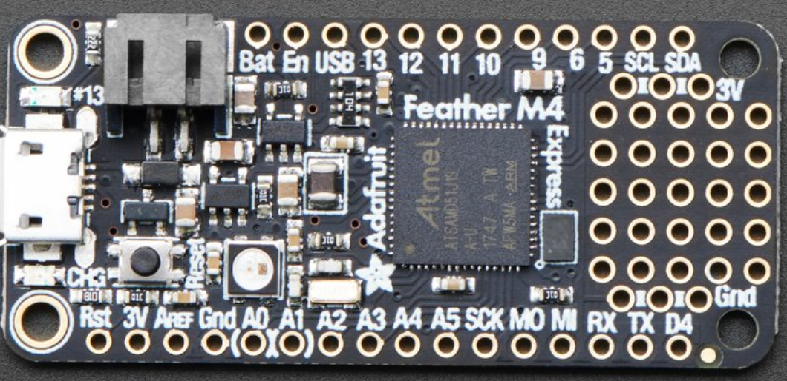

**Figure 1:** The large chip in the center is the ATSAMD51 microcontroller, which contains the processor and the flash memory for storing program code and data. The small chip to its right is the 2 MB flash memory that holds your files. The microcontroller handles the USB connection to the host computer itself. The pins for the analog and digital I/O lines are spaced so that the PCB can be plugged into a solderless breadboard.

The figure below shows the connection diagram of the [Feather M4 Express microcontroller board](https://www.adafruit.com/product/3857), an [ATSAMD51 microcontroller](https://www.microchip.com/en-us/product/ATSAMD51J19A) mounted on a printed circuit board (PCB) with some additional components to support rapid prototyping.

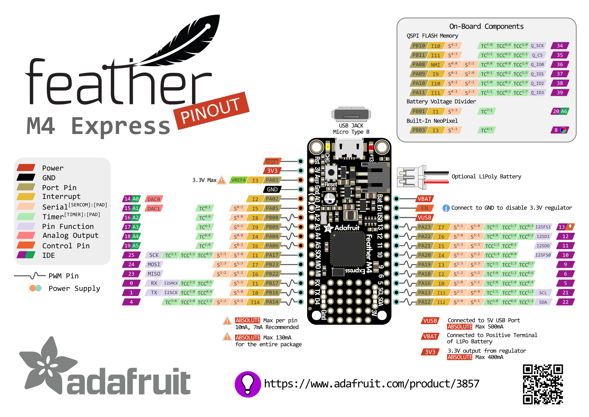

*Figure 2: Feather M4 Express pin connection diagram*

# The Solderless Breadboard

The M4 is a powerful little microcontroller. However, you will need to build external circuits to interface with the board. Engineers, hobbyists, and makers often use a solderless breadboard to quickly build circuits and prototype ideas.

Looking at a breadboard, you will see many, many little holes where you can stick wires and various components. Each row of 5 holes is connected internally by a metal clip.

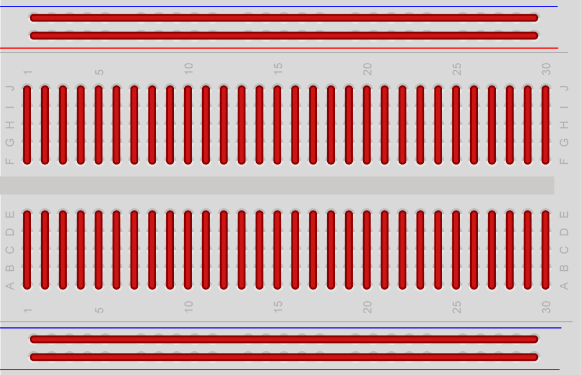

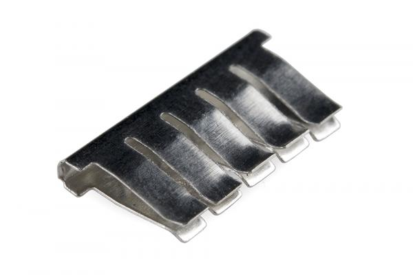

Here is one of the clips removed from the back of a breadboard.

Any wires or metal leads that are inserted into the holes will be electrically connected to anything else placed in that row. This is because the metal clips are conductive and allow current to flow from any point in that strip.

Notice that there are only five clips along this strip. This is typical of almost all breadboards. Each row has ten holes, separated by a ravine, or crevasse, in the middle of the breadboard. This ravine isolates the two sides of a given row from one another, so they are not electrically connected.

In addition to the rows, there are two columns on either side of the board. These are called the **power bus** (or power rails). Each column is connected by one continuous rail of metal clips. Engineers generally connect 3.3 V (the pin labeled 3V on the Feather) to the (+) column and GND to the (−) column.

**Exercise 1.**

The word “circuit” has the same root as the word “circle.” A circuit must have a complete loop that includes a power source.

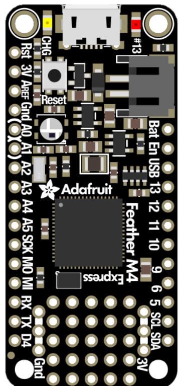

Larger circuits can often become quite complex. In practice, engineers often simplify their circuit drawings by using (+V) to designate the positive side of the power supply and (GND), or ground, to designate the negative side. Do you see the similarity between the two circuit diagrams?

1.  Build the circuit: connect the 3V pin to the (+) power bus and a GND pin to the (−) power bus. Connect a resistor (220–330 Ω) from the (+) bus to the long leg of an LED, and connect the short leg of the LED to the (−) bus. Connect the M4 Express to your computer with a USB cable to power it. If you’ve done it correctly, the LED should light up! If it doesn’t, try to figure out why. (Hint: Take a look at your LED; the longer leg is the positive end.)

***

**Exercise 2.**

For this exercise, you will learn how to control the state of the LED.

The first thing you'll want to do is download the most recent version of CircuitPython. This is a bit of a tedious process. Fortunately, we only need to do it once.

Go to [CircuitPython.org](https://circuitpython.org/downloads) to download the latest software for your board.

Our board is a Feather M4 Express, so you should download the latest **stable** release for the Feather M4 Express (<https://circuitpython.org/board/feather_m4_express/>). The file format is UF2 (which stands for USB Flashing Format). Save the file onto your laptop.

**Start the UF2 Bootloader**

***

Nearly all CircuitPython boards ship with a bootloader called UF2 that makes installing and updating CircuitPython a quick and easy process. The bootloader is the mode your board needs to be in for the CircuitPython **.uf2** file you downloaded to work.

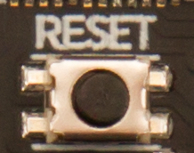

Find the reset button on your board. It's a small, black button, and the only button available.

Tap this button twice to enter the bootloader. If it doesn't work on the first try, don't be discouraged. The rhythm of the taps needs to be correct, and sometimes it takes a few tries. Once successful, the RGB LED on the board will flash red and then stay green. A new drive called FEATHERBOOT will show up on your computer.


The board is now in bootloader mode! This is what we need to install or update CircuitPython.

Now find the file you downloaded. Drag that file to the FEATHERBOOT drive on your computer. (The screenshot below shows a different board, whose drive is called CPLAYBOOT; the process is the same.)

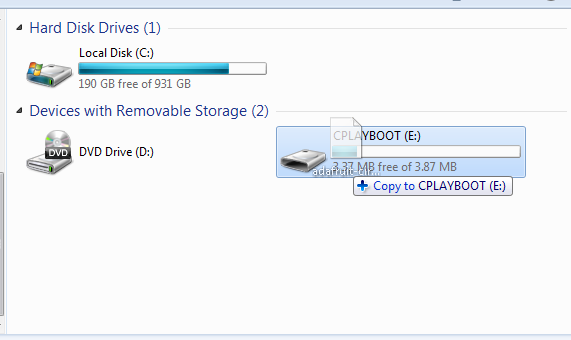

The lights should flash again, FEATHERBOOT will disappear, and a new drive called CIRCUITPY will show up on your computer.

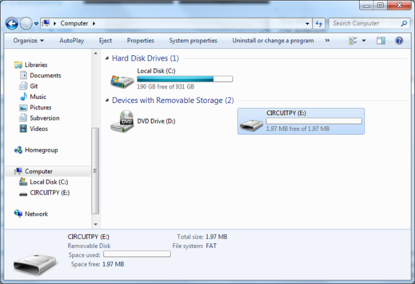

Congratulations! You've successfully installed or updated CircuitPython!

**What's the difference between CIRCUITPY and FEATHERBOOT?**

When you plug a CircuitPython board into your computer, your computer will see the board's flash memory as a USB flash drive where files can be stored. When you have successfully installed CircuitPython, you'll see the CIRCUITPY drive. When you double-tap the reset button, you'll see the FEATHERBOOT drive. You can drag files to both, but only CIRCUITPY will run your CircuitPython code.

Normally, when you drag a file to a mounted USB drive, the file copies to the drive and then can be seen in your file explorer. However, when you drag the CircuitPython UF2 file to the FEATHERBOOT drive, it seems to disappear, and the drive disconnects. This is normal! The UF2 is essentially an installer file; it does not simply sit on the drive, but installs CircuitPython if the board is in bootloader mode (i.e., FEATHERBOOT).

You will be able to copy other files to the bootloader drive (FEATHERBOOT), but they will not run or be accessible to CircuitPython. So once you're done installing CircuitPython, make sure that you're dragging files to, and editing files on, the CIRCUITPY drive!

**The CIRCUITPY Drive**

When CircuitPython finishes installing, or you plug a CircuitPython board into your computer with CircuitPython already installed, the board shows up on your computer as a USB drive called **CIRCUITPY**.

The **CIRCUITPY** drive is where your code and the necessary libraries and files will live. You can edit your code directly on this drive, and when you save, it will run automatically. When you create and edit code, you'll save your code in a code.py file located on the **CIRCUITPY** drive. If you're following along with an Adafruit Learn guide, you can paste the contents of the tutorial example into code.py on the **CIRCUITPY** drive and save it to run the example.

CircuitPython looks for code.py and runs the contents of the file automatically when the board starts up, reloads, or when you save changes to the file. This is what makes it so easy to get started with your project and update your code!

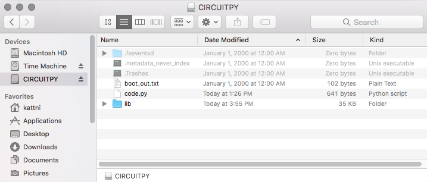

**Creating and Editing Code**

One of the best things about CircuitPython is how simple it is to get code up and running. In this section, we're going to cover how to create and edit your first CircuitPython program.

To create and edit code, all you'll need is an editor. There are many options. **We will be using [Mu](https://codewith.mu/en/download). It's designed for CircuitPython, and it's really simple and easy to use, with a built-in serial console!**

> **Note:** The Mu project was retired in 2025. Mu still works, but it is no longer maintained. Good alternatives are the browser-based [CircuitPython Code Editor](https://code.circuitpython.org/) and [Thonny](https://thonny.org/) (choose the "CircuitPython (generic)" interpreter under Tools > Options > Interpreter).

**Creating Code**

| 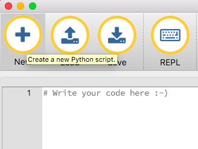 | Open your editor, and create a new file. If you are using Mu, click the **New** button in the top left. |
|-------------------------------------------------------------------------------------------------------|--------------------------------------------------------------------------------------------------------|

Write the following code into your editor:

````python
import board
import digitalio
import time

led = digitalio.DigitalInOut(board.D13)
led.direction = digitalio.Direction.OUTPUT

while True:
    led.value = True
    time.sleep(0.5)
    led.value = False
    time.sleep(0.5)
````

| 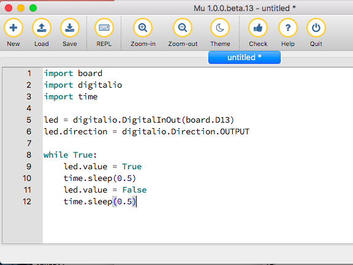   | It will look like this. Note that the four lines under the `while True:` line are indented with spaces, and they're all indented by exactly the same amount. All other lines have no spaces before the text. |
|---------------------------------------------------------------------------------------------------------|--------------------------------------------------------------------------------------------------------------------------------------------------------------------------------------------------------------|
| 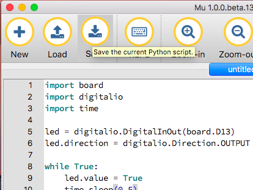   | Save this file as **code.py** on your CIRCUITPY drive.       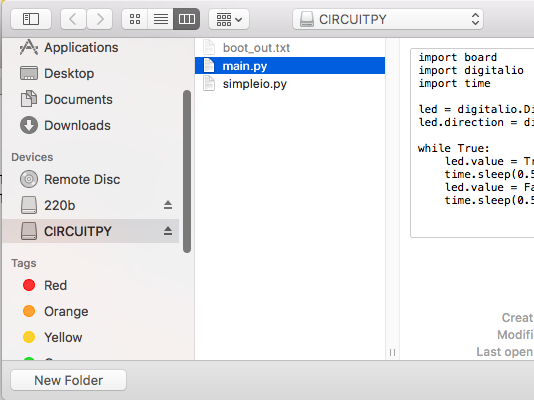                                           |

**Editing Code**

| 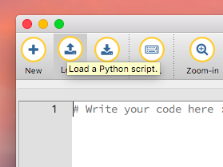 | To edit code, open the **code.py** file on your CIRCUITPY drive in your editor. Make the desired changes to your code. Save the file. That's it! |
|-------------------------------------------------------------------------------------------------------|------------------------------------------------------------------------------------------------------------------------------------------------------|

Your code changes are run as soon as the file is done saving.

There's just one warning we have to give you before we continue...

> **Don't press reset or unplug the board right after saving!** The CircuitPython code on your board detects when the files are changed or written and will automatically restart your code. This makes coding very fast because you save, and it re-runs. However, your computer may take a few seconds to finish writing the file to the board. If you unplug or reset the board before the write is complete, the file can be lost or the CIRCUITPY drive can be corrupted. Editors such as Mu, Thonny, and the CircuitPython Code Editor write the file completely when you save.

Back to editing code...

Now! Let's try editing the program you added to your board. Open your **code.py** file in your editor. We'll make a simple change. Change the first 0.5 to 0.1. The code should look like this:

````python
import board
import digitalio
import time

led = digitalio.DigitalInOut(board.D13)
led.direction = digitalio.Direction.OUTPUT

while True:
    led.value = True
    time.sleep(0.1)
    led.value = False
    time.sleep(0.5)
````

Leave the rest of the code as is. Save your file. See what happens to the LED on your board? Something changed! Do you know why? Let's find out!

**Exploring Your First CircuitPython Program**

***

First, we'll take a look at the code we're editing.

Here is the original code again:

````python
import board
import digitalio
import time

led = digitalio.DigitalInOut(board.D13)
led.direction = digitalio.Direction.OUTPUT

while True:
    led.value = True
    time.sleep(0.5)
    led.value = False
    time.sleep(0.5)
````

**Exercise 3.**

For this exercise, you will learn how to control the state of an external LED.

1.  Take out the wire that connected the resistor and LED to the (+) power bus in the previous circuit. Move this wire over to digital I/O pin 12. Pin 12 behaves like a switched power source that the M4 Express can control! It outputs 3.3 V or 0 V depending on your program, and you can change it at will.

***


2.  Open your editor and write the blink program above, changing `board.D13` to `board.D12`.

***

3.  Save it as **code.py**. Your code should run, and the light should blink.

***
