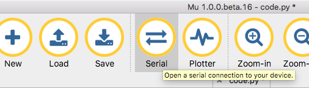
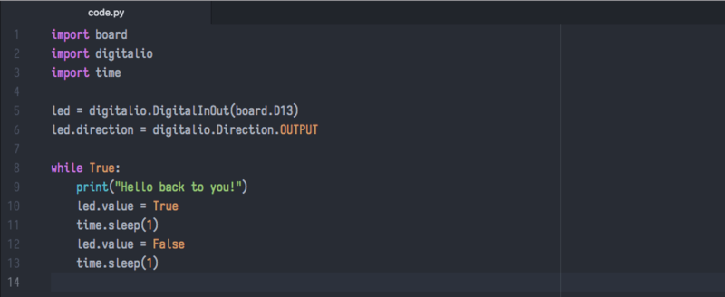
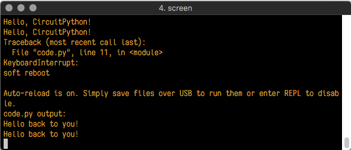
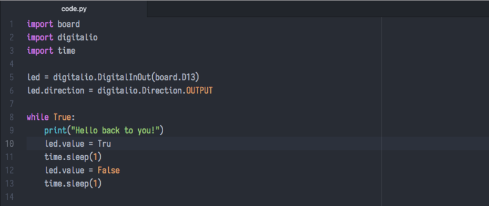
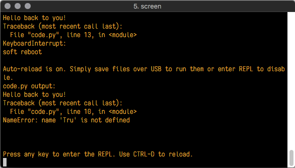
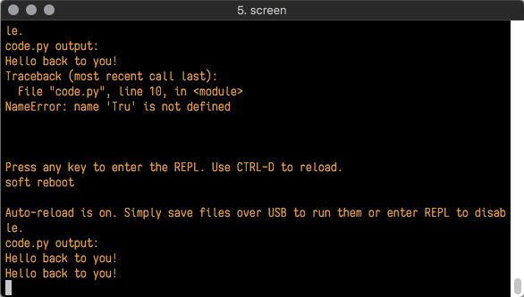

First, we'll look at the code we have worked on.

Here is the original code again:

````PYTHON
1.  import board
2.  import digitalio
3.  import time
4.  
5.  led = digitalio.DigitalInOut(board.D13)
6.  led.direction = digitalio.Direction.OUTPUT
7.  
8.  while True:
9.    led.value = True
10.   time.sleep(0.5)
11.   led.value = False
12.   time.sleep(0.5)
````

Let’s try to understand the components of the program.

**Imports & Libraries**

Each CircuitPython program you run needs to have a lot of information to work. The reason CircuitPython is so simple to use is that most of that information is stored in other files and works in the background. These files are called **libraries**. Some of them are built into CircuitPython. Others are stored on your CIRCUITPY drive in a folder called **lib**.

````python
1.  import board
2.  import digitalio
3.  import time
````

The import statements tell the board that you're going to use a particular library in your code. In this example, we imported three libraries: board, digitalio, and time. All three of these libraries are built into CircuitPython, so no separate files are needed. That's one of the things that makes this an excellent first example. You don't need anything extra to make it work! board gives you access to the *hardware on your board*, digitalio lets you *access that hardware as inputs/outputs* and time let's you pass time by 'sleeping'

**Setting Up The LED**

The next two lines setup the code to use the LED.

````python
1.  led = digitalio.DigitalInOut(board.D13)
2.  led.direction = digitalio.Direction.OUTPUT
````

Your board knows the red LED as D13. So, we initialise that pin, and we set it to output. We set led to equal the rest of that information so we don't have to type it all out again later in our code.

**Loop-de-loops**

The third section starts with a while statement. while True: essentially means, "forever do the following:". while True: creates a loop. Code will loop "while" the condition is "true" (vs. false), and as True is never False, the code will loop forever. All code that is indented under while True: is "inside" the loop.

Inside our loop, we have four items:

````python
1.  while True:
2.    led.value = True
3.    time.sleep(0.5)
4.    led.value = False
5.    time.sleep(0.5)
````

First, we have led.value = True. This line tells the LED to turn on. On the next line, we have time.sleep(0.5). This line is telling CircuitPython to pause running code for 0.5 seconds. Since this is between turning the led on and off, the led will be on for 0.5 seconds.

The next two lines are similar. led.value = False tells the LED to turn off, and time.sleep(0.5) tells CircuitPython to pause for another 0.5 seconds. This occurs between turning the led off and back on so the LED will be off for 0.5 seconds too.

Then the loop will begin again and continue to do so as long as the code is running!

So, when you changed the first 0.5 to 0.1, you decreased the amount of time that the code leaves the LED on. So, it blinks on quickly before turning off!

**Connecting to the Serial Console**

One of the staples of debugging is something called a "print statement". This is a line you include in your code that causes your code to output text. A print statement in CircuitPython looks like this:

print("Hello, world!")

This line would result in:

Hello, world!

However, these print statements need somewhere to display. That's where the serial console comes in!

The serial console receives output from your CircuitPython board sent over USB and displays it so you can see it. This is necessary when you've included a print statement in your code and you'd like to see what you printed. It is also helpful for troubleshooting errors because your board will send errors, and the serial console will print those, too.  
  
The serial console requires a terminal program. A terminal is a program that gives you a text-based interface to perform various tasks.

The serial console **is built into Mu** and will **autodetect your board** making using the REPL *really easy*.

Once in Mu, look for the **Serial** button in the menu and click it.



**Interacting with the Serial Console**

Once you've successfully connected to the serial console, it's time to start using it.

The code you wrote earlier has no output to the serial console. So, we're going to edit it to create some output.

Open your code.py file in your editor and include a print statement. You can print anything you like! Just include your phrase between the quotation marks inside the parentheses. For example:

````python
1.  import board
2.  import digitalio
3.  import time
4.  
5.  led = digitalio.DigitalInOut(board.D13)
6.  led.direction = digitalio.Direction.OUTPUT
7.  
8.  while True:
9.    print("Hello, Class of PHY 130")
10.   led.value = True
11.   time.sleep(1)
12.   led.value = False
13.   time.sleep(1)
````

Save your file.

Now, let's go look at the window with our connection to the serial console.

Your print statement is showing up in your console!

Try changing the printed text to something else.



Keep your serial console window where you can see it. Save your file. You'll see what the serial console displays when the board reboots. Then you'll see your new change!



The Traceback (most recent call last): is telling you the last thing your board was doing before you saved your file. This is normal behavior and will happen every time the board resets. This is handy for troubleshooting. Let's introduce an error so we can see how it is used.

Delete the e at the end of True from the line led.value = True so that it says led.value = Tru



Save your file. You will notice that your red LED will stop blinking, and you may have a colored status LED blinking at you. This is because the code is no longer correct and can no longer run properly. We need to fix it!

Usually, when you run into errors, it's not because you introduced them on purpose. You may have 200 lines of code and have no idea where your error could be hiding. This is where the serial console can help. Let's take a look!



The Traceback (most recent call last): is telling you that the last thing it was able to run was line 10 in your code. The next line is your error: NameError: name 'Tru' is not defined. This error might not mean a lot to you but combined with knowing the issue is on line 10, it gives you a great place to start!

Go back to your code and look at line 10. Obviously, you know what the problem is already. But if you didn't, you'd want to look at line 10 and see if you could figure it out. If you're still unsure, try googling the error to get some help. In this case, you know what to look for. You spelled True wrong. Fix the typo and save your file.



Nice job fixing the error! Your serial console is streaming and your red LED Is blinking again.

The serial console will display any output generated by your code. Some sensors, such as a humidity sensor or a thermistor, receive data and you can use print statements to display that information. You can also use print statements for troubleshooting. If your code isn't working, and you want to know where it's failing, you can put print statements in various places to see where it stops printing.

The serial console has many uses and is an amazing tool overall for learning and troubleshooting!

**Exercise 4**

The first part of interfacing with hardware is being able to manage digital inputs and outputs.

This example shows how to use both digital input and output. You can use a switch *input* with a pullup resistor to control a digital output – say, a red LED on pin 12.

````python
1.  \# CircuitPython General Purpose I/O
2.  import time
3.  import board
4.  from digitalio
5.  
6.  led = digitalio.DigitalInOut(board.D12)
7.  led.direction = digitalio.Direction.OUTPUT
8.  
9.  switch = digitalio.DigitalInOut(board.D11)
10. switch.direction = digitalio.Direction.INPUT
11. 
12. while True:
13. \# We could also do "led.value = not switch.value"!
14.   if switch.value:
15.     time.sleep(1.0)
16.     led.value = False
17.
18.   else:
19.     time.sleep(6.0)
20.     led.value = True
21. 
22.   time.sleep(0.1) \# small pause
````


**Exercise 5**

Set three LED a red green and a blue and control the state of the LEDs with the switch button.

The three LED represent traffic lights and the switch is used by a pedestrian to cross the street. Set up a circuit and a program that represent a realist traffic light.

**Exercise 6**

It is a little tedious to deal with three separate LEDs. The RGB led is a led with three integrated colors. This kind of RGB led is called common cathode RGB led, since the three LEDS share a common cathode (the ground). The ground of RGB led can be easily identified by noting that it is the longest pin.


Set up two RGB LEDs and a switch to mimic two crossing lanes.
